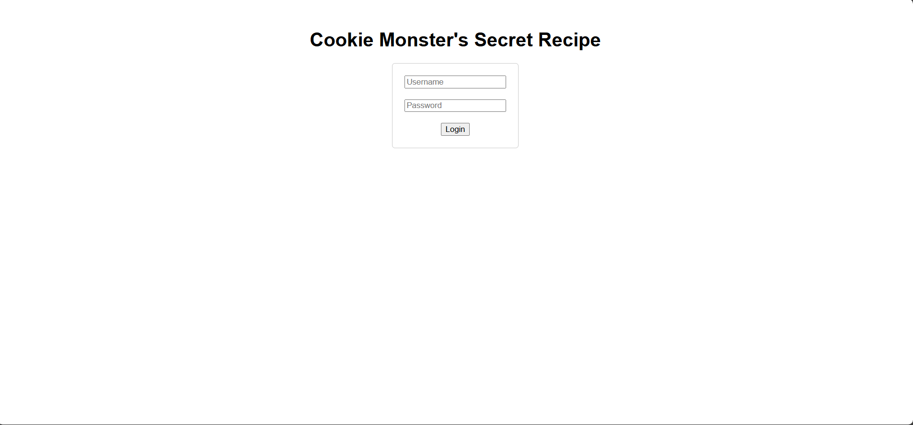

#Cookie Monster Secret Recipe
###### Solved by @Yago Martins
> This is a CTF about Web / Web Exploitation.
## About the Challenge
Esse desafio consiste em um site que contém uma flag escondida em alguma parte do sistema do site, desafiando o usuário a explorar os fundamentos do site para decifrar a flag.

## Solution
Ao me deslocar para o link do site, após ler o título do desafio: "Cookie Monster...", eu relacionei essa palavra 'cookie' com os 'cookies', que é uma extensão presente em todos os sites, imaginando ter alguma dica
sobre como solucionar a flag.

Após clicar em qualquer parte da tela com o botão direito, eu cliquei em inspecionar, Aplicativo, Cookies e me deparei com uma extensão escrita:"secret_recipe", e  após clicar sobre,
me deparei com um texto cifrado: "cGljb0NURntjMDBrMWVfbTBuc3Rlcl9sMHZlc19jMDBraWVzX0E5NjRBMTM0fQ%3D%3D", o %3D%3D corresponde a ==, ficando assim em um código cifrado de base 64, que após decifrar me retornou a flag.

>`pic0CTF{c00k1e_m0nster_l0ves_c00kies_A964A134}`
 
