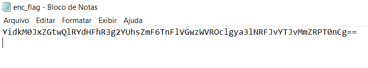
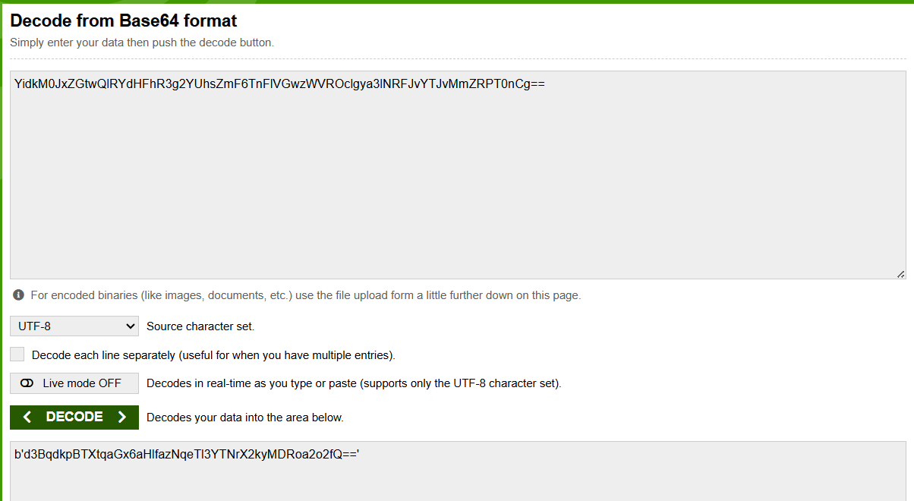

#Interencdec
###### Solved by @Yago Martins
> This is a CTF about Reverse Engineering / Script Logic.
## About the Challenge
Esse desafio oferece ao desafiante um arquivo sem extensão, que ao abrir como '.txt' contem um texto codificado, no qual o desafiante terá de usar diversos métodos de decodificação a partir da análise dos resultados.

## Solution
Ao analisar o texto, você pode deduzir que se trata de um arquivo codificado com base 64 pelo conjunto de caracteres, tamanho e por terminar com = ou ==, após decodificar você obtém:

Enfim, me deparei com um texto cifrado: "cGljb0NURntjMDBrMWVfbTBuc3Rlcl9sMHZlc19jMDBraWVzX0E5NjRBMTM0fQ%3D%3D",no qual interpretei que %3D%3D corresponde a ==, ficando assim em um código cifrado de base 64, que após decifrar me retornou a flag.

>`pic0CTF{c00k1e_m0nster_l0ves_c00kies_A964A134}`
 

