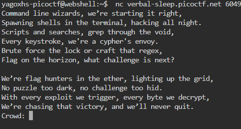
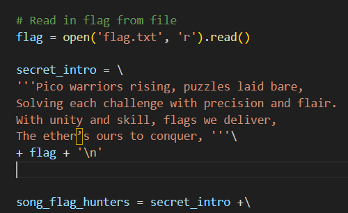
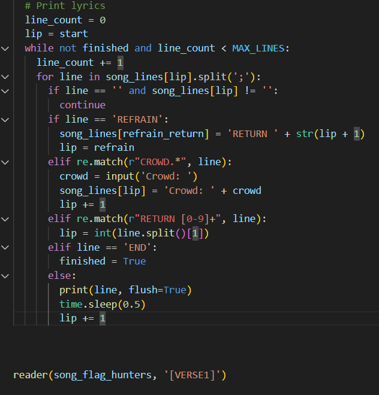
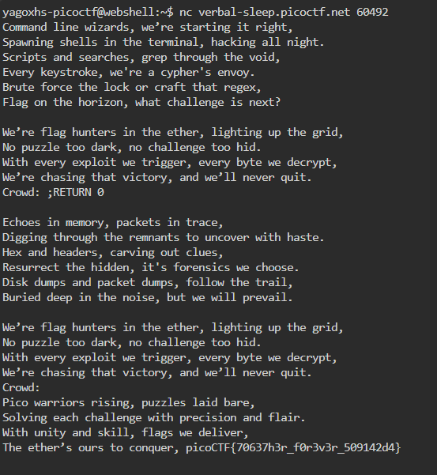

#Cookie Monster Secret Recipe
###### Solved by @Yago Martins
> This is a CTF about Binary Exploitation.
## About the Challenge
Esse desafio começa com o desafiante tendo acesso a um arquivo de código fonte '.py' e um link de conexão ncat para rodar um programa: '$ nc verbal-sleep.picoctf.net 60492' o programa roda versos de uma música que ao final de sua primeira parte de execução pede o input de uma senha 'Crowd' para decidir como o programa irá funcionar. O desafio conciste basicamente em você analisar o código fonte para saber qual 'Crowd' correta para o programa lhe retornar uma flag entre os versos da música.

## Solution
O primeiro passo a se fazer é abrir o código fonte e analisá-lo, logo nas primeiras linhas do código, você já identifica a posição da flag:

Após essa análise, ja podemos interpretar que a flag está dentro de uma intro secreta do código, basta sabermos como podemos retorná-la para os versos para saber qual a flag escondida.

Agora direto ao ponto, onde o código determina a saída dos versos, notemos que na linha: 'for line in song_lines[lip].split(';'):', definimos que o código divide cada linha da música em partes separadas por ponto e vírgula (;), Sendo assim, nossa 'Crowd' deverá iniciar utilizando o ';'.

Agora na linha: 'elif re.match(r"RETURN [0-9]+", line): lip = int(line.split()[1])', O ponteiro lip, que indica qual linha da música está sendo processada, é colocado em 0. A linha 0 da música é: "Pico warriors rising, puzzles laid bare, ..." ou seja, contém o início da flag.

Após essa Análise basta juntarmos as duas soluções e após o input do Cwrd, a senha será: (;RETURN 0).

>`picoCTF{70637h3r_f0r3v3r_509142d4}`
 
